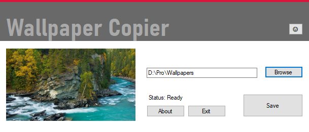
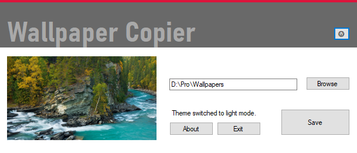
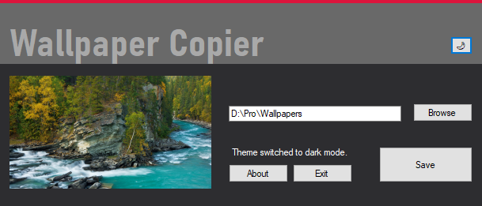
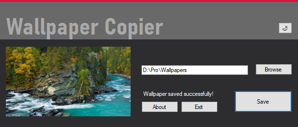

# Wallpaper Copier

**Wallpaper Copier** is a simple and intuitive tool designed to help you manage and save your desktop wallpapers effortlessly. Switch between light and dark themes and ensure your favorite wallpapers are saved with unique filenames.

## Features

- **Save Current Wallpaper**: Quickly save the current desktop wallpaper with a unique filename, avoiding duplicates.
- **Toggle Themes**: Switch between light and dark themes. The dark mode uses a comfortable `#2d2d30` color for a pleasant viewing experience.
- **Persistent Settings**: The application remembers your last used theme and directory settings by saving them in a temporary JSON file.
- **Modern UI**: Enjoy a sleek, title-bar-free design with easy window dragging by clicking anywhere, including panels.
- **In-App Notifications**: Get status updates within the application, avoiding disruptive pop-ups.
- **Customizable Icon**: Personalize the app with your own icon to enhance its appearance.

## How It Works

1. **Save Wallpapers**: Click the "Save" button to store your current wallpaper in the specified directory, ensuring no duplicates with unique filenames.
2. **Switch Themes**: Use the theme button to toggle between day and night modes. Your preference is remembered even after closing the app.
3. **Drag and Move**: Click anywhere on the app, including panels, to move the window freely.

## Previews

### Main Interface


### Light Theme


### Dark Theme


### Save Notification


## Installation

### Prerequisites

- [.NET 6.0 Runtime](https://dotnet.microsoft.com/download/dotnet/6.0)

### Steps

1. Clone the repository:
   ```sh
   git clone https://github.com/OmniTx/WallpaperCopierApp.git
   cd WallpaperCopier
2. Build the solution:
   ```sh
   dotnet build
3. Run the application:
   ```sh
   dotnet run

## Contributing

Contributions are welcome! Please feel free to submit a pull request or open an issue to improve the application.

## Developer

- **Name**: ImranAh
- **Contact**: itsimran.official001@gmail.com
- **GitHub**: [OmniTx](https://github.com/OmniTx)

## License

This project is licensed under the MIT License. See the [LICENSE](LICENSE) file for details.
